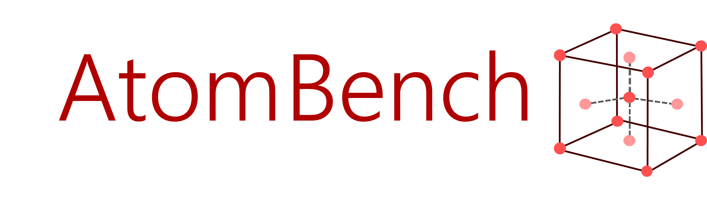

<div align="center">



**A Python package for benchmarking generative crystal reconstruction models**

[](https://arxiv.org/abs/2510.16165)
[](LICENSE)
[](pyproject.toml)
[](https://github.com/crhysc/jarvis-tools-notebooks/blob/master/atombench_example.ipynb)

</div>

<h1></h1>

**AtomBench is a Python package for benchmarking generative crystal-reconstruction models.** Point it at a model's predicted structures and it scores how faithfully they reconstruct the targets. Its main use is running several models in one go, where it overlays them in shared figures and gathers their metrics into a single table.

We also used AtomBench to run our own study, benchmarking four models (AtomGPT, CDVAE, FlowMM, and MatterGen) on the JARVIS Supercon-3D and Alexandria DS-A/B superconductivity datasets. Those benchmarks are fully reproducible through the Snakemake pipeline in this repository.

## Contents

- [Quick Start: the `atombench` package](#quick-start-the-atombench-package)
- [Reproducing the Full Benchmark](#reproducing-the-full-benchmark)
- [Working with Snakemake](#working-with-snakemake)
- [Troubleshooting](#troubleshooting)
- [Tutorials](#tutorials)
- [Citation](#citation)
- [License](#license)

The repository has two parts you can use independently:

- **`atombench`** is the Python package. It turns a model's benchmark CSVs into reconstruction metrics, figures, and tables, and runs anywhere with Python 3.9+.
- **The Snakemake pipeline** is how we produced the benchmarks in our study. It trains and evaluates the models that generate those CSVs, and needs a Linux HPC cluster with SLURM and CUDA 11.8.

<h1></h1>

## Quick Start: the `atombench` package

The `atombench` package reads benchmark CSVs from any generative model and produces reconstruction metrics, figures, and summary tables. It doesn't depend on the Snakemake pipeline, so you can point it at CSVs you already have.

Install it:

```bash
pip install atombench
```

Run it:

```bash
atombench PATH OUTDIR
```

`PATH` is usually a directory of benchmark CSVs, one per model, which AtomBench runs together and overlays in the figures and metrics table. A single CSV works the same way for one model. For example:

```
benchmarks/
├── atomgpt.csv
├── cdvae.csv
├── flowmm.csv
└── mattergen.csv
```

```bash
atombench benchmarks/ out/
```

`out/` then holds two folders:

```
out/
├── figures/                  # plots (PNG), all models overlaid
└── numerical_calculations/   # metrics_table.{json,tex}, epic_metrics.csv
```

A `metrics.json` is also written next to each input CSV and reused as a cache on later runs.

Every input CSV needs three columns:

- `id`: a unique identifier for the structure
- `target`: the ground-truth structure, as a POSCAR-formatted string
- `prediction`: the model's structure, as a POSCAR-formatted string

<h1></h1>

## Reproducing the Full Benchmark

This section covers re-running the Snakemake pipeline on an HPC cluster to reproduce the results from scratch. There is also a [guided walkthrough in Google Colab](https://github.com/crhysc/jarvis-tools-notebooks/blob/master/atombench_example.ipynb).

### Requirements

The pipeline is built for Linux HPC clusters and will not run on macOS, Windows, or non-SLURM systems. You'll need:

- Linux with the SLURM scheduler
- a CUDA 11.8 module
- a conda installation whose shell hook works (see below)

Before anything else, run `bash depcheck.sh`. It checks your OS, scheduler, CUDA module, and conda/mamba setup, and tells you what to fix.

The pipeline activates environments through conda's shell hook:

```bash
eval "$(conda shell.bash hook)"
```

To confirm yours works, `conda deactivate` should drop the `(base)` prefix from your prompt, and re-running the hook should bring it back:

```console
(base) [user@hpc-cluster ~]$ conda deactivate
[user@hpc-cluster ~]$ eval "$(conda shell.bash hook)"
(base) [user@hpc-cluster ~]$
```

See the [conda activation docs](https://docs.conda.io/projects/conda/en/latest/dev-guide/deep-dives/activation.html) if it doesn't.

### Installation

**1. Clone the repository.** Use SSH, not HTTPS; the vendored models require it.

```bash
git clone git@github.com:atomgptlab/atombench.git
```

**2. Initialize the submodules.** The generative models live in `models/` as git submodules.

```bash
git submodule update --init --recursive
```

**3. Create and activate the environment.**

```bash
conda create --name atombench python=3.11 pip -y
conda activate atombench
```

**4. Add mamba.** FlowMM's environment setup is memory-hungry and can run out of memory; mamba avoids that. Setting up the FlowMM environment can take 20–60 minutes.

```bash
conda install -n atombench -c conda-forge mamba -y
```

**5. Install the Python dependencies.**

```bash
pip install atombench snakemake dvc ase jarvis-tools==2026.1.10
```

### Running the pipeline

Set `ABS_PATH` in `scripts/absolute_path.sh` to the repository's absolute path (run `pwd` from the repo root to get it):

```bash
#!/bin/bash
export ABS_PATH="/path/to/this/repository"
```

Then launch the pipeline:

```bash
snakemake -p --verbose all --cores 1
```

Snakemake works through every benchmark in dependency order. The next section explains how that works and what to do when a job fails.

<h1></h1>

## Working with Snakemake

This is the operational guide for running, debugging, and recovering the pipeline. If you've never used Snakemake, read [How it works](#how-it-works) first.

### How it works

Snakemake builds a dependency graph of jobs and runs only the ones whose outputs are missing or out of date.

The root `Snakefile` defines `rule all`, which lists every final target the pipeline produces. Each model/dataset benchmark has its own Snakefile under `job_runs/<benchmark>/` that the root pulls in as a module, so reading the root `Snakefile` is the clearest way to see the whole dependency structure.

Progress is tracked with marker files in the repository root. When a benchmark finishes, Snakemake creates a `*.final` file such as `agpt_benchmark_jarvis.final`. Their presence is how Snakemake knows a step is done, which is also what makes manual recovery possible.

A dry run prints the plan without running anything:

```bash
snakemake -n all            # show the next jobs
snakemake -n --quiet all    # same, without the extra log noise
```

### When a job fails

By default Snakemake often prints only `job failed` and hides the real error. There are two ways to get it back.

Re-run with the failed-job logs attached:

```bash
snakemake -p --verbose --show-failed-logs all --cores 1
```

If the failure happens during environment creation, run the environment job directly:

```bash
bash job_runs/agpt_benchmark_alex/conda_env.job
bash job_runs/cdvae_benchmark_alex/conda_env.job
bash job_runs/flowmm_benchmark_alex/conda_env.job
```

The actual cause is almost always in the individual job log, not in Snakemake's summary.

### Manual recovery

On some clusters a long job or an interactive install will kill Snakemake before the work actually finishes. You can pick up by hand without breaking its bookkeeping:

1. Run `snakemake -n all` to see what's left.
2. Go to the relevant `job_runs/<benchmark>/` directory and run its scripts yourself (with `bash` or `python`, depending on the job).
3. When the job succeeds, create its marker file so Snakemake counts it as done:
   ```bash
   touch agpt_benchmark_jarvis.final
   ```
4. Re-run `snakemake -n all`. The finished jobs drop out and only the remaining targets are reported. Repeat until `rule all` is satisfied.

Once every benchmark CSV exists (all `*.final` markers are present), you can run the analysis step on its own:

```bash
atombench job_runs/ atombench_output/
```

This keeps Snakemake's dependency tracking intact while letting you work around the transient scheduler and environment hiccups that are common on shared HPC systems.

### Tips

- Dry-run with `snakemake -n all` before any real run; it shows exactly what will execute.
- The `Snakefile`'s `rule all` and the modules it imports are the source of truth for the DAG. Read it when the job ordering is unclear.
- A missing `*.final` marker means Snakemake treats that step as incomplete. `touch`-ing it after the work is genuinely done is the supported way to resume.
- When a job dies, running its script directly under `job_runs/` gives you the error output Snakemake swallows.
- If something fails in a way that makes no sense, run `depcheck.sh` again; most surprises are environment-level.

### GPU selection

Each Snakefile under `job_runs/` sets its own `sbatch` directives, including a specific GPU request (A100, H100, L40S, and so on). If your cluster doesn't have or doesn't allow the requested type, the job fails. The fix is to edit that Snakefile (or its job script) and swap in a GPU you do have.

<h1></h1>

## Troubleshooting

- **`conda activate` does nothing or errors.** Your shell isn't initialized. Run `eval "$(conda shell.bash hook)"` and check for `(base)` in your prompt.
- **Strange, hard-to-place failures.** You probably have more than one Python manager active at once (conda, micromamba, system Python). Stick to a single conda installation and confirm `which python` points inside the active environment.
- **Cryptic CUDA or scheduler errors right away.** You're likely on an unsupported system: the pipeline needs Linux + SLURM + CUDA 11.8.
- **`models/` is empty or incomplete.** You skipped `git submodule update --init --recursive`.
- **Snakemake only says "job failed".** The real error is in the job log; re-run with `--show-failed-logs`, or run the failing job script directly.

For anything not listed here, run `bash depcheck.sh` first; it catches most environment problems before they turn into downstream failures.

<h1></h1>

## Tutorials

Per-model setup and usage notebooks:

- [AtomGPT](https://github.com/knc6/jarvis-tools-notebooks/blob/master/jarvis-tools-notebooks/atomgpt_example.ipynb)
- [CDVAE](https://github.com/crhysc/jarvis-tools-notebooks/blob/master/jarvis-tools-notebooks/cdvae_example.ipynb)
- [FlowMM](https://github.com/crhysc/jarvis-tools-notebooks/blob/master/jarvis-tools-notebooks/flowmm_example.ipynb)

<h1></h1>

## Citation

If you use AtomBench in your research, please cite:

```bibtex
@article{campbell2026atombench,
  title   = {AtomBench: A Benchmarking Framework for Generative Crystal Reconstruction Models in Conventional Superconductors},
  author  = {Campbell, Charles Rhys and Romero, Aldo H. and Choudhary, Kamal},
  year    = {2026},
}
```

<h1></h1>

## License

Released under the [MIT License](LICENSE).
